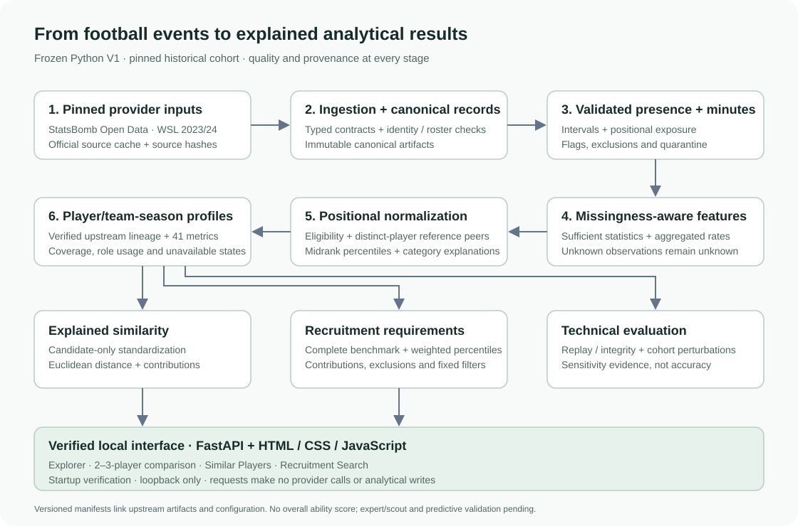
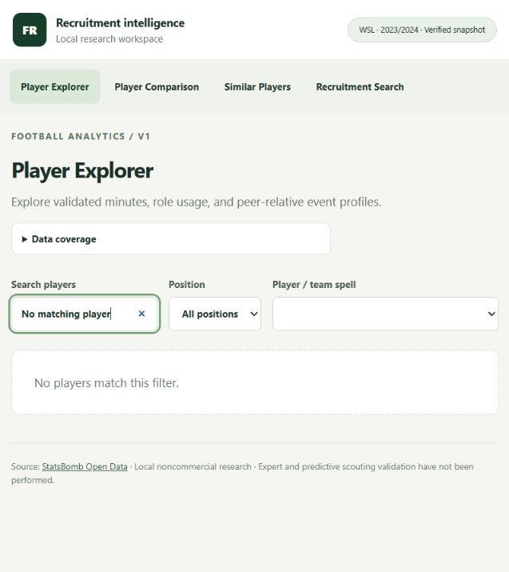
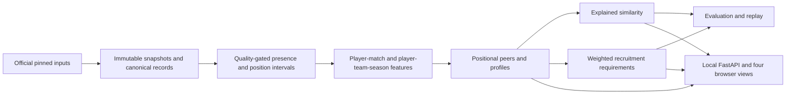

# Football Recruitment Intelligence Engine

**Historical football event analytics with a traceable path from source to shortlist.**

V1 transforms raw events into positional player profiles, similarity search and
explainable recruitment rankings. It helps an analyst inspect the benchmark,
evidence gaps and trade-offs behind each result.

**V1 complete · 226 tests passing · Reproducible locally · MIT code**

**[Portfolio project](https://hyzentech.github.io/projects/football-recruitment-intelligence-engine/)
· [Technical case study](https://hyzentech.github.io/blog/football-recruitment-intelligence-engine/)
· [v1.0.0 release](https://github.com/HyzenTech/football-recruitment-intelligence-engine/releases/tag/v1.0.0)
· [Run locally](#reproduce-and-run)**

I built the end-to-end Python pipeline, strict data contracts, quality-gated
features, positional normalization, explained statistical retrieval and weighted
ranking, plus four analytical views and reproducibility checks. Numerical methods
use Python's standard library; this is not a trained predictive scouting model.

The interactive analytical application is reproducible locally from this source.
The public presentation includes architecture, methods and verification evidence;
provider datasets and derived player-data files are excluded. See [release scope](docs/PUBLIC_RELEASE.md).




Data source: [StatsBomb Open Data](https://github.com/hudl/open-data).
Independent, noncommercial historical research. Provider data and logo retain
separate terms; see [DATA_LICENSE.md](DATA_LICENSE.md).

## Why this project

A shortlist is only useful when an analyst can explain its inputs, benchmark and
trade-offs. This project follows each recommendation back to canonical events,
validated playing time, explicit metric formulas and a complete positional peer
population. It exposes evidence gaps instead of filling them with invented stats.

## What works

| View | Analyst task | Evidence shown |
|---|---|---|
| Player Explorer | Inspect a player/team season | Minutes, role usage, 41 metrics, coverage and peer percentiles |
| Comparison | Compare two or three team spells | Metric values and position-specific benchmark warnings |
| Similar Players | Find nearby event profiles | Distance, proximity index, metric differences and self-exclusion |
| Recruitment Search | Rank candidates for explicit priorities | Editable weights, percentiles, contributions and exclusions |



Actual application capture with an empty search. The full local application supports
the four views above; this public image contains no player statistics.

## Reproduce and run

Use Python **3.12**, [uv](https://docs.astral.sh/uv/getting-started/installation/),
and an extracted source checkout. Run from its root:

```console
uv sync --locked
uv run --locked fre check
uv run --locked python scripts/reproduce.py --serve
```

Before downloading inputs, review the provider agreement and its registration
request in [DATA_LICENSE.md](DATA_LICENSE.md). The commands below obtain data
directly from the provider for your local use; this repository supplies no dataset.

The runner obtains the pinned official inputs, builds all stages, verifies their
artifacts, runs twenty evaluation perturbations, and launches the local app.
Open http://127.0.0.1:8765 after startup verification. Ctrl+C stops it.
No authentication token is required. Initial dependency installation and ingestion
need network access; later analytics and the interface run locally.

With an existing verified provider cache:

```console
uv run --locked --offline python scripts/reproduce.py --offline --serve
```

Omit `--serve` to build and verify only. The runner automatically passes manifest
paths between stages and writes an ignored `outputs/v1-reproduction.json` receipt.
Any failed stage stops subsequent work. A fresh checkout has no provider cache;
offline mode deliberately fails if inputs are missing or corrupt. Elapsed time
and disk use depend on the machine and cache; no performance benchmark is claimed.

For an existing build, launch directly using the profile path from the receipt:

```console
uv run --locked fre serve --config-dir config --manifest data/processed/statsbomb/4b73468fc5b0f1950f9f66fada70ad3a4f9327cb/37-281/profiles-0.5.0/manifests/166bde6549efa2e42cff2ae9a1865fb707b56082cb6f67464d6ec950f653763a.json --port 8765
```

That path identifies the default pinned configuration. Changed analytic settings
produce their own manifests. See [the reproduction guide](docs/REPRODUCIBILITY.md)
for individual commands, failure recovery and clean package checks.

## Architecture and data pipeline



Canonical domain contracts separate provider mapping from analytics. Player
identity is separate from team membership, so transfers retain distinct team
spells. Pipeline manifests link source hashes, configuration and artifact versions.
The interface verifies the snapshot before startup and computes without provider
requests or data mutations. [Architecture](docs/ARCHITECTURE.md) explains module
boundaries and [the interface contract](docs/INTERFACE.md) lists API routes.

```text
config/                       pinned data and explicit analytic conventions
src/football_recruitment/
  domain/ providers/ ingestion/ canonical contracts, mapping and immutable inputs
  preprocessing/ validation/   presence reconstruction and quality gates
  features/ normalization/     metrics, aggregation and positional profiles
  similarity/ ranking/         pure, explainable calculations and artifact replay
  evaluation/ api/             stability audits and the local application
scripts/reproduce.py           complete build and verification runner
tests/                        synthetic calculations, boundaries and HTTP contracts
docs/                         formulas, decisions, audit and checkpoints
data/ outputs/                ignored local inputs, artifacts and reports
```

## Data and scope

StatsBomb Open Data, **FA Women's Super League 2023/24**, competition 37 / season
281, is pinned to revision `4b73468fc5b0f1950f9f66fada70ad3a4f9327cb`.
The [data audit](docs/audit/PHASE_0_AUDIT.md) selected a coherent full league season
with useful event and positional coverage rather than mixing unrelated leagues.

| Verified local baseline | Count |
|---|---:|
| Matches / teams | 132 / 12 |
| Canonical events | 495,189 |
| Player/team-season profiles / unique players | 303 / 295 |
| Peer-eligible profiles | 139 |
| Metric definitions | 41 |

football-data.org remains a future metadata adapter; it does not power V1 event
analytics. Age/U23, market values, contracts, continuous tracking and learned
roles have no supporting evidence in this cohort.

## Data engineering: preserve evidence before calculating rates

Lineup/card-clock inconsistencies, zero-length and reversed positional intervals,
and unclassified pass outcomes can undermine a denominator or apparent metric
completeness. V1 retains source observations and quality flags, quarantines
unresolved appearances, and preserves unknown values. It does not silently
invent corrected exposure or treat unknown observations as zero.
See [minutes](docs/MINUTES.md) and [features](docs/FEATURES.md).

## Methods and explanations

**Features:** counts/sums use `90 × total / validated minutes`; means and
percentages retain their native units. Elapsed minutes include stoppage time and
are derived from presence intervals. Progressive action thresholds are explicit
project conventions. Creation includes shot-linked xG assisted rather than an
unqualified xA claim. Unknown contributing opportunities suppress complete
metrics instead of becoming zero. [Formulas](docs/FEATURES.md),
[minutes](docs/MINUTES.md).

The 41 implemented metrics span passing/entries, progression, carries, creation,
shooting/context, defensive activity, retention and recorded involvement/location.
Long passes count attempts of at least 30 provider yards; tackles and interceptions
retain their event definitions. Carry displacement uses the configured grid, not
tracking distance in metres. Category composites use declared equal weights and
complete common populations. The [metric catalog](docs/FEATURES.md) is authoritative.

**Profiles:** at least 450 validated minutes, 60% dominant position usage and ten
complete peers are required for comparison. Percentiles use direction-aware
midranks within role. Composite categories expose equal weights and common
complete populations. No overall player rating is produced. [Profile policy](docs/PROFILES.md).

**Similarity:** complete within-position feature vectors are standardized against
eligible candidates; every spell of the query player is excluded. Euclidean
distance is explained by metric differences. The index `100 / (1 + distance)`
is a proximity transformation, not a probability or ability score. Goalkeepers
use distribution metrics only. [Feature sets and formulas](docs/SIMILARITY.md).

**Recruitment:** nonnegative weights normalize to sum to one. The requirement
score is the weighted sum of direction-aware metric percentiles in one complete
reference population. Candidate filters retain that benchmark; missing metrics
never cause hidden reweighting. Each row exposes component contributions and
weaker requested dimensions. Unsupported filters are rejected. [Ranking contract](docs/RANKING.md).

## Evaluation and practical limits

226 tests pass on the tested Windows/Python 3.12 environment: 220 frozen analytical tests and six static-export boundary tests. Combined checks
cover 1,280 baseline neighbor rows and 60 ranking rows. Replay verifies outputs
against upstream artifacts, and HTTP calculations match the offline engines.
The [Phase 8 checkpoint](docs/PHASE_8.md) and [evaluation protocol](docs/EVALUATION.md)
record deterministic sensitivity tests and twenty reproducible cohort perturbations.

| Perturbation diagnostic | Availability | Mean top-five overlap when available |
|---|---:|---:|
| CB similarity | 660 / 660 | 79.55% |
| ST similarity | 202 / 280 | 82.18% |
| CB defensive ranking | 20 / 20 | 83.00% |
| ST shooting ranking | 18 / 20 | 84.44% |

These overlaps measure cohort sensitivity, not scouting accuracy. AM/CM peer
shortages suppress comparisons/rankings, and ST failures accompany its overlap
average. One limited, nonprofessional human qualitative review (CASE-03) is
completed; expert/scout validation and predictive outcome validation remain
**pending / NOT_PERFORMED**. Technical reproducibility is not football accuracy.

The model does not adjust for team possession or tactical context. Correlated
metrics, conservative completeness, broad positional mapping and activity bias
limit interpretation. Goalkeeper shot stopping, affordability and transfer
availability are unsupported. See [all limitations](docs/LIMITATIONS.md).

## Demonstration and engineering evidence

Follow the [five-minute walkthrough](docs/DEMO.md) to inspect a profile, compare
players, explain a nearest neighbor, change recruitment weights and inspect an
unavailable result. The [portfolio case study](docs/PORTFOLIO.md) explains key
engineering decisions and how a reviewer can verify them.

```console
uv run --locked pytest -p no:cacheprovider
uv run --locked ruff check .
uv run --locked ruff format --check .
uv sync --locked --group build
uv build --no-build-isolation
```

Tests use synthetic football inputs and do not download data. Source distributions
include configuration, documentation, tests and the reproduction runner; wheels
include the application and its HTML/CSS/JS assets. Generated data and secrets
are excluded. No package registry publication is performed.

## Human review: CASE-03

One limited qualitative centre-back review found agreement around
interceptions and tackling/defensive activity. It also surfaced positioning
mistakes, risky possession decisions, pressure context, score state and the
consequences of decisions that event-based activity scoring cannot adequately
capture. The sample was one match with skipped portions, with 30 timestamped
observations and unknown continuous viewing duration. Numerical ratings remain
unassessed. It did not justify recalibration and does not establish general
model validity. Expert/scout and predictive validation remain pending.
Raw review notes remain private. [Review protocol](docs/FOOTBALL_VALIDATION.md).

## Limitations

- One historical open-data season, limited competition coverage and no current
  global player database.
- Event activity lacks possession, opponent, score-state and tactical-context
  adjustment; broad positions are not tracking-derived tactical roles.
- Correlated metrics can amplify emphasis. Incomplete observations exclude
  dimensions; small peer groups suppress results.
- No transfer-market, salary/contract, injury or availability intelligence.
- Goalkeeper analysis covers distribution, not shot-stopping ability.
- One limited qualitative review; general accuracy and transfer suitability
  are not established.
- Local research software, not a professionally validated transfer
  recommendation system or a production multi-user service.

## Reproducibility and release evidence

Download the audited source and packages from the [v1.0.0 release](https://github.com/HyzenTech/football-recruitment-intelligence-engine/releases/tag/v1.0.0).
The original canonical archive remains unchanged. The public release has separate [baseline provenance](docs/BASELINE_PROVENANCE.json) and
[validation summary](docs/VALIDATION.md). All analytical source, original tests and
configurations are hash-checked against the original. Publication files have
their own manifest; it is not the canonical archive's original manifest.

## Rights

Project code is licensed under [MIT](LICENSE). Provider-data rights, logos and
third-party content remain separate; see [DATA_LICENSE.md](DATA_LICENSE.md) and
[third-party notices](THIRD_PARTY_NOTICES.md).

StatsBomb Open Data is the source of the historical research described here.
Source credit and the official attribution logo are included. This MIT grant
covers original code only. Provider datasets and machine-readable derived player
exports are excluded; no permission to redistribute them is claimed. Noncommercial
research findings are presented under the provider's analysis-sharing terms.

## Demonstrated technologies

Python 3.12, FastAPI, Pydantic, Uvicorn, HTML/CSS/JavaScript, uv, pytest, Ruff and
Hatchling. Statistical retrieval and weighted ranking use Python's standard
library; V1 does not train a predictive ML model.

## Roadmap and publication status

**Analytical V1 is frozen.** Future directions include fresh expert validation,
current-season providers, entity resolution, expanded football validation,
deployment and a natural-language scouting interface. The separate Stage C
static presentation is implemented locally; V1.1 has not started.

The public V1 release presents the source and engineering case study. The full
application and exported-data interface remain local. GitHub Pages cannot run
the FastAPI backend. Public dataset redistribution and real-data demo hosting
remain outside [this release's scope](docs/PUBLIC_RELEASE.md).
